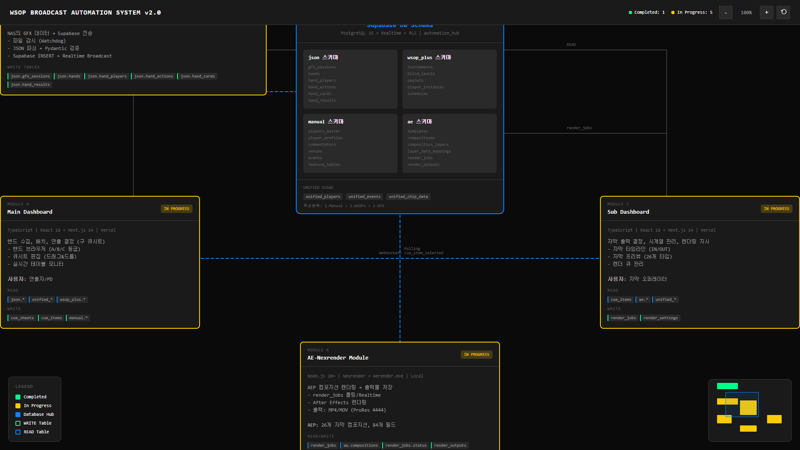

# GFX Data Pipeline Architecture

WSOP 포커 방송 자동화 시스템의 전체 데이터 파이프라인 아키텍처 문서

> **관련 문서**
> - [DB 스키마 상세 설계](architecture.md) - DDL, ERD, Enum 타입 정의
> - [아키텍처 요약](ARCHITECTURE_ANALYSIS.md) - Executive Summary
> - [프로젝트 현황](AUTOMATION_PROJECTS_REPORT.md) - 7개 프로젝트 현황
> - [AEP 필드 매핑](GFX_AEP_FIELD_MAPPING.md) - 26개 컴포지션 84개 필드 매핑
>
> **모듈별 세부 설계**
> - [Module 1-2 설계](MODULE_1_2_DESIGN.md) - GFX 시뮬레이터 + NAS-Supabase Sync
> - [Module 3-5 설계](MODULE_3_5_DESIGN.md) - Supabase Schema + Main/Sub Dashboard
> - [Module 6 설계](MODULE_6_DATAFLOW_DESIGN.md) - AE-Nexrender + 통합 데이터 흐름
> - [병렬 개발 계획](PARALLEL_DEVELOPMENT_PLAN.md) - 3-Phase 병렬 에이전트 오케스트레이션

---

## 1. 개요

### 1.1 목적

PokerGFX 데이터를 수집하여 After Effects 자막으로 자동 변환하는 **End-to-End 방송 자동화 시스템**

### 1.2 핵심 특징

- **6-모듈 아키텍처**: GFX Simulator → Sync → Supabase → Main/Sub Dashboard → AE-Nexrender
- **역할 분리**: 연출 결정(Main) vs 자막 출력(Sub)
- **데이터 통합 우선순위**: Manual > WSOP+ > GFX
- **실시간 통신**: Supabase Realtime + WebSocket

### 1.3 시스템 개요도



---

## 2. 6개 모듈 구성

| # | 모듈명 | 역할 | 기술 스택 | 상태 |
|---|--------|------|----------|------|
| 1 | **GFX 시뮬레이터** | GFX 테스트용 시뮬레이터 앱 | Python, Streamlit | ✅ 완료 |
| 2 | **GFX-NAS-Supabase Sync** | NAS의 GFX 데이터 → Supabase 전송 | Python, Watchdog, asyncio | 🔄 개발중 |
| 3 | **Supabase DB Schema** | 전체 DB 설계 (4개 스키마) | PostgreSQL 15, Supabase | 🔄 개발중 |
| 4 | **Main Dashboard** | 핸드 수집, 배치, 연출 결정 | React, Next.js, TypeScript | 🔄 개발중 |
| 5 | **Sub Dashboard** | 자막 출력 결정, 시계열 관리, 렌더링 지시 | React, Next.js, TypeScript | 🔄 개발중 |
| 6 | **AE-Nexrender 모듈** | AEP 렌더링 → 출력물 저장 | Node.js, Nexrender | 🔄 개발중 |

---

## 3. 전체 시스템 흐름

```
┏━━━━━━━━━━━━━━━━━━━━━━━━━━━━━━━━━━━━━━━━━━━━━━━━━━━━━━━━━━━━━━━━━━━━━━━━━━━━━━━━━┓
┃                    WSOP BROADCAST AUTOMATION SYSTEM v2.0                         ┃
┃                           6-MODULE ARCHITECTURE                                   ┃
┗━━━━━━━━━━━━━━━━━━━━━━━━━━━━━━━━━━━━━━━━━━━━━━━━━━━━━━━━━━━━━━━━━━━━━━━━━━━━━━━━━┛

[MODULE 1] GFX Simulator (✅ 완료)
────────────────────────────────────
┌─────────────┐  ┌─────────────┐  ┌─────────────┐
│ Feature     │  │ Feature     │  │ Feature     │
│ Table #1    │  │ Table #2    │  │ Table #N    │
└──────┬──────┘  └──────┬──────┘  └──────┬──────┘
       │                │                │
       └────────────────┼────────────────┘
                        │ JSON Files
                        ▼
               ┌─────────────────┐
               │   NAS (SMB)     │
               │ GFX JSON 공유   │
               └────────┬────────┘
                        │
                        ▼
[MODULE 2] GFX-NAS-Supabase Sync (🔄 개발중)
────────────────────────────────────────────
┌──────────┐   ┌──────────┐   ┌──────────┐   ┌──────────┐
│ Watchdog │ → │  JSON    │ → │ Pydantic │ → │ Supabase │
│ 파일감지 │   │  Parser  │   │  검증    │   │   API    │
└──────────┘   └──────────┘   └──────────┘   └────┬─────┘
                                                  │
                                    Realtime Broadcast
                                                  ▼
[MODULE 3] Supabase DB Schema (🔄 개발중)
────────────────────────────────────────────
┌─────────────────────────────────────────────────────────────────┐
│                      SUPABASE (PostgreSQL 15)                    │
├────────────────┬────────────────┬────────────────┬──────────────┤
│   json 스키마  │ wsop_plus 스키마│  manual 스키마  │   ae 스키마   │
├────────────────┼────────────────┼────────────────┼──────────────┤
│ gfx_sessions   │ tournaments    │ players_master │ templates    │
│ hands          │ blind_levels   │ player_profiles│ compositions │
│ hand_players   │ payouts        │ commentators   │ comp_layers  │
│ hand_actions   │ player_instances│ venues        │ data_mappings│
│ hand_cards     │ schedules      │ events         │ render_jobs  │
│ hand_results   │                │ feature_tables │ render_outputs│
└────────────────┴────────────────┴────────────────┴──────────────┘
                               │
         ┌─────────────────────┴─────────────────────┐
         │                                           │
         ▼                                           ▼
[MODULE 4] Main Dashboard                [MODULE 5] Sub Dashboard
     (🔄 개발중)                              (🔄 개발중)
─────────────────────                    ─────────────────────
역할: 연출 의사결정                       역할: 자막 출력 실행
     (What/When)                              (How)

사용자: 연출자/PD                        사용자: 자막 오퍼레이터

┌─────────────────┐                      ┌─────────────────┐
│ 핸드 브라우저   │                      │ 자막 타임라인   │
│ 큐시트 편집     │──WebSocket──────────→│ 자막 프리뷰     │
│ 실시간 모니터   │  cue_item_selected   │ 렌더 큐         │
└─────────────────┘                      └────────┬────────┘
                                                  │
                                         render_jobs INSERT
                                                  │
                                                  ▼
[MODULE 6] AE-Nexrender Module (🔄 개발중)
─────────────────────────────────────────────
┌──────────────┐   ┌──────────────┐   ┌──────────────┐
│ render_jobs  │ → │After Effects │ → │ 출력 파일    │
│ 대기작업조회 │   │ aerender.exe │   │ (MP4/MOV)    │
└──────────────┘   └──────────────┘   └──────┬───────┘
                                             │
                                             ▼
                                    ┌────────────────┐
                                    │ \\nas\renders  │
                                    │ 로컬 네트워크  │
                                    └────────┬───────┘
                                             │
                                             ▼
                                    ┌────────────────┐
                                    │  vMix/OBS      │
                                    │  방송 송출     │
                                    └────────────────┘
```

---

## 4. 모듈 간 데이터 흐름

### 4.1 데이터 흐름 요약

```
[1] GFX Simulator        ──JSON──▶  NAS

[2] GFX-NAS-Supabase     ◀──JSON──  NAS
                         ──INSERT─▶ Supabase (json.*)
                         ──Realtime─▶ Main Dashboard

[3] Supabase             ◀──READ/WRITE── 모든 모듈
                         ──Realtime──▶ 실시간 알림

[4] Main Dashboard       ◀──Realtime── Supabase (gfx_hands)
                         ──WRITE──▶ cue_sheets, cue_items
                         ──WebSocket──▶ Sub Dashboard

[5] Sub Dashboard        ◀──WebSocket── Main Dashboard
                         ◀──READ── unified_*, ae.*
                         ──WRITE──▶ render_jobs

[6] AE-Nexrender         ◀──Polling── render_jobs
                         ──UPDATE──▶ render_jobs.status
                         ──INSERT──▶ render_outputs
                         ──FILE──▶ \\nas\renders
```

---

## 5. DB 테이블 매핑표

### 5.1 모듈별 READ/WRITE 권한

| 스키마 | 테이블 | GFX Sync | Main Dash | Sub Dash | AE-Nexrender |
|--------|--------|:--------:|:---------:|:--------:|:------------:|
| **json** | gfx_sessions | **W** | R | R | - |
| json | hands | **W** | R | R | - |
| json | hand_players | **W** | R | R | - |
| json | hand_actions | **W** | R | R | - |
| json | hand_cards | **W** | R | R | - |
| json | hand_results | **W** | R | R | - |
| **wsop_plus** | tournaments | - | R | R | - |
| wsop_plus | payouts | - | R | R | - |
| wsop_plus | player_instances | - | R | R | - |
| **manual** | players_master | - | **R/W** | R | - |
| manual | player_profiles | - | **R/W** | R | - |
| manual | commentators | - | **R/W** | R | - |
| **ae** | compositions | - | - | R | R |
| ae | composition_layers | - | - | R | R |
| ae | layer_data_mappings | - | - | R | R |
| ae | render_jobs | - | - | **W** | **R/W** |
| ae | render_outputs | - | R | R | **W** |
| **cuesheet** | broadcast_sessions | - | **W** | R | - |
| cuesheet | cue_sheets | - | **W** | R | - |
| cuesheet | cue_items | - | **W** | R | - |
| **views** | unified_players | - | R | R | - |
| views | unified_events | - | R | R | - |
| views | unified_chip_data | - | R | R | - |

### 5.2 통합 뷰 (Unified Views)

| 뷰 | 목적 | 우선순위 |
|-----|------|----------|
| unified_players | 플레이어 통합 | 1.Manual > 2.WSOP+ > 3.GFX |
| unified_events | 이벤트 통합 | 1.Manual > 2.WSOP+ > 3.GFX |
| unified_chip_data | 칩 데이터 병합 | 1.WSOP+ > 2.GFX |

---

## 6. Main Dashboard vs Sub Dashboard 역할 분리

### 6.1 역할 비교

| 항목 | Main Dashboard | Sub Dashboard |
|------|----------------|---------------|
| **핵심 기능** | 연출 의사결정 (What/When) | 자막 출력 실행 (How) |
| **사용자** | 연출자/PD | 자막 오퍼레이터 |
| **데이터 조회** | 핸드, 플레이어, 등급 | 자막 매핑, 렌더 설정 |
| **렌더링 지시** | ❌ 불가 | ✅ 가능 |
| **큐시트 편집** | ✅ 가능 | 읽기 전용 |
| **실시간 모니터** | 테이블 상태, 핸드 등급 | 렌더 진행률, 출력 결과 |

### 6.2 분리 이유

1. **관심사 분리**: 연출 결정(What/When) vs 실행(How)
2. **권한 분리**: 렌더링은 자막팀만, 큐시트는 연출팀만
3. **부하 분산**: 렌더 큐 관리 부하를 별도 UI로 분리
4. **유연성**: 각각 독립 배포/업데이트 가능

---

## 7. 실시간 통신 패턴

### 7.1 Supabase Realtime 채널

| 채널 | Trigger | From | To | Payload |
|------|---------|------|-----|---------|
| `gfx_hands` | INSERT | GFX-NAS-Sync | Main Dashboard | `{ id, session_id, hand_num, blinds }` |
| `render_jobs` | INSERT, UPDATE | Sub Dashboard, AE-Nexrender | 양방향 | `{ id, status, progress, comp_name }` |
| `render_outputs` | INSERT | AE-Nexrender | Sub Dashboard | `{ id, file_path, job_id }` |

### 7.2 WebSocket Direct (Main ↔ Sub)

| Event | From | To | Payload |
|-------|------|-----|---------|
| `cue_item_selected` | Main Dashboard | Sub Dashboard | `{ cue_item_id, caption_type, gfx_data, scheduled_time, duration_seconds }` |
| `render_status_update` | Sub Dashboard | Main Dashboard | `{ cue_item_id, job_id, status, progress, output_path? }` |

---

## 8. 기술 스택 정리

### 8.1 모듈별 기술 스택

| 모듈 | 언어 | 프레임워크 | DB Client | 실시간 | 배포 |
|------|------|-----------|-----------|--------|------|
| GFX Simulator | Python 3.11+ | Streamlit | - | - | Local |
| GFX-NAS-Sync | Python 3.11+ | Watchdog, asyncio | supabase-py | Realtime | NAS |
| Supabase DB | PostgreSQL 15 | - | - | Realtime | Cloud |
| Main Dashboard | TypeScript | React 18, Next.js 14 | @supabase/js | WebSocket | Vercel |
| Sub Dashboard | TypeScript | React 18, Next.js 14 | @supabase/js | WebSocket | Vercel |
| AE-Nexrender | Node.js 20+ | Nexrender | @supabase/js | Polling | Local |

### 8.2 공통 인프라

| 영역 | 기술 |
|------|------|
| Database | Supabase (PostgreSQL 15 + Realtime + RLS) |
| Validation | JSON Schema Draft 2020-12, Pydantic v2, Zod |
| AEP Template | 26개 자막 컴포지션, 84개 동적 필드 |
| Real-time | Supabase Realtime, Custom WebSocket Server |

---

## 9. 프로젝트 역할 매핑

| 프로젝트 | 모듈 | 역할 | 상태 |
|---------|------|------|------|
| automation_feature_table | Module 1 | GFX 시뮬레이터 | ✅ 완료 |
| automation_hub | Module 2, 3 | NAS Sync, Supabase 스키마 | 🔄 개발중 |
| (신규) | Module 4 | Main Dashboard | 🔄 개발중 |
| (신규) | Module 5 | Sub Dashboard | 🔄 개발중 |
| automation_ae | Module 6 | AE-Nexrender | 🔄 개발중 |
| automation_orchestration | - | 전체 문서/모니터링 | 📄 문서화 |
| automation_aep | - | AEP 템플릿 분석 | ✅ 완료 |

---

## 10. 구현 우선순위

### Phase 1: 핵심 파이프라인
- [ ] GFX-NAS-Supabase Sync 완성
- [ ] Supabase 스키마 완성 (25개 테이블)
- [ ] unified_* 통합 뷰

### Phase 2: 대시보드 MVP
- [ ] Main Dashboard MVP (핸드 브라우저 + 큐시트)
- [ ] Sub Dashboard MVP (자막 선택 + 렌더 큐)
- [ ] WebSocket 연동

### Phase 3: 렌더링 통합
- [ ] AE-Nexrender 통합
- [ ] 엔드투엔드 테스트
- [ ] 장애 복구 시나리오

---

## 11. 검증 계획

### 11.1 데이터 흐름 검증
- [ ] GFX JSON → NAS → Supabase 파이프라인
- [ ] Supabase Realtime → Main Dashboard 알림
- [ ] Main → Sub WebSocket 연동
- [ ] Sub → AE-Nexrender render_jobs 연동

### 11.2 렌더링 검증
- [ ] render_jobs 생성 → 렌더링 → 출력물 확인
- [ ] 렌더 큐 모니터링
- [ ] 실패 시 재시도 로직

---

*최종 수정: 2026-01-15*
