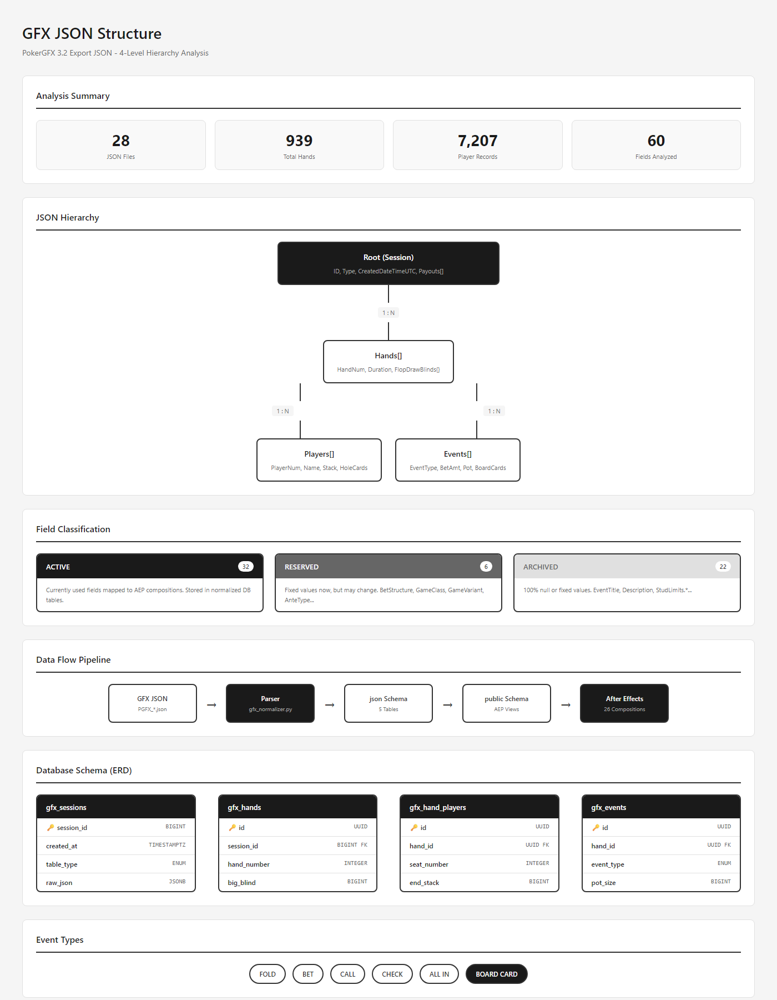

# GFX JSON 원본 구조 분석

**Version**: 1.0.0
**Last Updated**: 2026-01-29
**분석 대상**: PokerGFX 3.2 export JSON

---

## 1. 개요

### 1.1 파일 개요

| 항목 | 값 |
|------|-----|
| 파일명 패턴 | `PGFX_live_data_export GameID={ID}.json` |
| 생성 소프트웨어 | PokerGFX 3.2 |
| 저장 위치 | `\\nas\broadcast\gfx_json\{source}\{date}\` |
| 인코딩 | UTF-8 |

### 1.2 분석 데이터 출처

| 소스 | 파일 수 | 핸드 수 | 플레이어 레코드 |
|------|---------|---------|-----------------|
| table-GG | 18개 | 323개 | 2,315개 |
| table-pokercaster | 10개 | 616개 | 4,892개 |
| **합계** | **28개** | **939개** | **7,207개** |

---

## 2. 계층 구조

> **시각화 다이어그램**: 아래 이미지는 JSON 계층 구조, 필드 분류, 데이터 흐름, ERD를 포함합니다.



### 2.1 JSON 트리 구조

| Level | 객체 | 주요 필드 |
|-------|------|----------|
| **Root** | Session | ID, Type, CreatedDateTimeUTC, Payouts[] |
| **L1** | Hands[] | HandNum, Duration, FlopDrawBlinds{} |
| **L2** | Players[] | PlayerNum, Name, Stack, HoleCards |
| **L2** | Events[] | EventType, BetAmt, Pot, BoardCards |

### 2.2 관계 요약

| 관계 | 카디널리티 | 설명 |
|------|-----------|------|
| Root → Hands | 1:N | 세션당 다수 핸드 |
| Hands → Players | 1:N | 핸드당 2-9명 플레이어 |
| Hands → Events | 1:N | 핸드당 다수 액션 |

---

## 3. Root Level 필드

### 3.1 필드 상세

| 필드 | 타입 | 예시 | null% | 설명 |
|------|------|------|-------|------|
| `ID` | bigint | `638961224831992165` | 0% | .NET DateTime.Ticks 기반 고유 ID |
| `CreatedDateTimeUTC` | string | `"2025-10-15T10:54:43.1992165Z"` | 0% | 세션 생성 시각 (ISO 8601) |
| `SoftwareVersion` | string | `"PokerGFX 3.2"` | 0% | 항상 동일 |
| `Type` | string | `"FEATURE_TABLE"` | 0% | 테이블 타입 |
| `EventTitle` | string | `""` | **100%** | 항상 빈 문자열 (미사용) |
| `Payouts` | int[] | `[0,0,0,0,0,0,0,0,0,0]` | 0% | 10개 요소, 현재 모두 0 |

### 3.2 ID 필드 분석

> **💡 변환 공식**
>
> `.NET DateTime.Ticks` = 0001-01-01 UTC부터의 **100나노초** 단위
>
> `Ticks ÷ 10 = 마이크로초` → Python datetime으로 변환

**변환 로직:**

| 단계 | 설명 | 코드 |
|:----:|------|------|
| 1 | epoch 설정 | `datetime(1, 1, 1, tzinfo=timezone.utc)` |
| 2 | 틱 → 마이크로초 | `ticks // 10` |
| 3 | 결과 계산 | `epoch + timedelta(microseconds=...)` |

**변환 예시:**

| Ticks 값 | 변환 결과 |
|----------|----------|
| `638961224831992165` | 2025-10-15 10:54:43 UTC |
| `638675000000000000` | 2024-12-01 00:00:00 UTC |

**전체 구현 (Python):**

```python
from datetime import datetime, timezone, timedelta

def ticks_to_datetime(ticks: int) -> datetime:
    """Convert .NET ticks to Python datetime"""
    epoch = datetime(1, 1, 1, tzinfo=timezone.utc)
    return epoch + timedelta(microseconds=ticks // 10)
```

### 3.3 Type 필드 값

| 값 | 설명 | 빈도 |
|----|------|------|
| `FEATURE_TABLE` | 피처 테이블 (방송 메인) | 대부분 |
| `FINAL_TABLE` | 파이널 테이블 | pokercaster만 |

---

## 4. Hands Level 필드

### 4.1 핵심 필드

| 필드 | 타입 | 예시 | 설명 |
|------|------|------|------|
| `HandNum` | int | `1`, `2`, `42` | 세션 내 핸드 순번 |
| `StartDateTimeUTC` | string | `"2025-10-15T12:03:20.9005907Z"` | 핸드 시작 시각 |
| `Duration` | string | `"PT3M26.9826834S"` | 핸드 소요 시간 (ISO 8601 Duration) |
| `AnteAmt` | int | `0`, `200`, `800` | 앤티 금액 |

### 4.2 Duration 파싱

> **💡 ISO 8601 Duration 형식**
>
> `PT{H}H{M}M{S}S` - Period/Time 구분자로 시작
>
> H(시), M(분), S(초) 각각 생략 가능

**파싱 로직:**

| 단계 | 설명 | 코드 |
|:----:|------|------|
| 1 | 정규식 매칭 | `r"PT(?:(\d+)H)?(?:(\d+)M)?(?:([\d.]+)S)?"` |
| 2 | 시간 추출 | `int(match.group(1) or 0)` |
| 3 | 분 추출 | `int(match.group(2) or 0)` |
| 4 | 초 추출 | `float(match.group(3) or 0)` |
| 5 | 총 초 계산 | `hours * 3600 + minutes * 60 + seconds` |

**파싱 예시:**

| Duration 문자열 | 분해 | 초 단위 |
|----------------|------|---------|
| `PT35M37.2477537S` | 35분 37.25초 | 2137.25 |
| `PT3M26.9826834S` | 3분 26.98초 | 206.98 |
| `PT19.5488032S` | 0분 19.55초 | 19.55 |
| `PT1H30M0S` | 1시간 30분 | 5400.00 |

**전체 구현 (Python):**

```python
import re

def parse_duration(duration_str: str) -> float:
    """ISO 8601 Duration → 초 단위"""
    pattern = r"PT(?:(\d+)H)?(?:(\d+)M)?(?:([\d.]+)S)?"
    match = re.match(pattern, duration_str)
    if not match:
        return 0.0
    hours = int(match.group(1) or 0)
    minutes = int(match.group(2) or 0)
    seconds = float(match.group(3) or 0)
    return hours * 3600 + minutes * 60 + seconds
```

### 4.3 고정값 필드

| 필드 | 고정값 | 비고 |
|------|--------|------|
| `BetStructure` | `"NOLIMIT"` | No Limit Hold'em |
| `GameClass` | `"FLOP"` | 플랍 게임 |
| `GameVariant` | `"HOLDEM"` | 텍사스 홀덤 |
| `NumBoards` | `1` | 단일 보드 |
| `RunItNumTimes` | `1` | 런잇원스 |
| `BombPotAmt` | `0` | 봄팟 미사용 |
| `Description` | `""` | 미사용 |

### 4.4 FlopDrawBlinds 객체

| 필드 | 타입 | 예시 | 설명 |
|------|------|------|------|
| `BigBlindAmt` | int | `800`, `2000`, `5000` | 빅 블라인드 |
| `SmallBlindAmt` | int | `80`, `1000`, `2500` | 스몰 블라인드 |
| `ButtonPlayerNum` | int | `1`~`9` | 딜러 버튼 위치 |
| `BigBlindPlayerNum` | int | `1`~`9` | BB 플레이어 |
| `SmallBlindPlayerNum` | int | `1`~`9` | SB 플레이어 |
| `AnteType` | string | `"BB_ANTE_BB1ST"` | BB 앤티 방식 |
| `BlindLevel` | int | `0` | 항상 0 (미사용) |
| `ThirdBlindAmt` | int | `0` | 미사용 |
| `ThirdBlindPlayerNum` | int | `0` | 미사용 |

### 4.5 StudLimits 객체 (미사용)

| 필드 | 값 | 비고 |
|------|-----|------|
| `BringInAmt` | `0` | Stud 전용 |
| `BringInPlayerNum` | `1` | Stud 전용 |
| `HighLimitAmt` | `0` | Stud 전용 |
| `LowLimitAmt` | `0` | Stud 전용 |

---

## 5. Players Level 필드

### 5.1 식별 필드

| 필드 | 타입 | 예시 | null% | 설명 |
|------|------|------|-------|------|
| `PlayerNum` | int | `1`~`9` | 0% | 좌석 번호 |
| `Name` | string | `"Phil"`, `"jhkg"` | 0% | 표시 이름 (짧은 형태) |
| `LongName` | string | `"Phil Ivey"` | 0.3~3.1% | 전체 이름 |

**소스별 PlayerNum 차이**:
- table-GG: 1~9 사용
- table-pokercaster: 2~9 사용 (1번 미사용)

### 5.2 칩 스택 필드

| 필드 | 타입 | 예시 | 설명 |
|------|------|------|------|
| `StartStackAmt` | int | `1224444`, `455523388` | 핸드 시작 스택 |
| `EndStackAmt` | int | `1224444`, `455523388` | 핸드 종료 스택 |
| `CumulativeWinningsAmt` | int | `-19000`, `3200` | 세션 누적 승패 |
| `BlindBetStraddleAmt` | int | `0` | 항상 0 (미사용) |

### 5.3 카드 및 상태 필드

| 필드 | 타입 | 예시 | 설명 |
|------|------|------|------|
| `HoleCards` | string[] | `["ah kd"]`, `[""]` | 홀 카드 배열 |
| `SittingOut` | bool | `false`, `true` | 자리 비움 상태 |
| `EliminationRank` | int | `-1`, `3`, `9` | 탈락 순위 (-1: 생존) |

**HoleCards 형식:**

| 값 | 의미 | 파싱 결과 |
|----|------|----------|
| `["ah kd"]` | 공개 (A♥ K♦) | `["ah", "kd"]` |
| `["10d 9d"]` | 공개 (10♦ 9♦) | `["10d", "9d"]` |
| `[""]` | 비공개 (폴드/미도달) | `[]` |

> **⚠️ 주의**: 공백으로 구분된 단일 문자열 → 배열로 분리 필요

### 5.4 통계 필드

| 필드 | 타입 | 범위 | 설명 |
|------|------|------|------|
| `VPIPPercent` | int | 0~100 | Voluntarily Put $ In Pot |
| `PreFlopRaisePercent` | int | 0~100 | Pre-Flop Raise 빈도 |
| `AggressionFrequencyPercent` | int | 0~100 | 공격성 지수 |
| `WentToShowDownPercent` | int | 0~100 | 쇼다운 도달 빈도 |

---

## 6. Events Level 필드

### 6.1 필드 상세

| 필드 | 타입 | 예시 | null% | 설명 |
|------|------|------|-------|------|
| `EventType` | string | `"FOLD"`, `"BET"` | 0% | 액션 타입 |
| `PlayerNum` | int | `0`~`9` | 0% | 0: 보드카드, 1-9: 플레이어 |
| `BetAmt` | int | `0`, `2000`, `50000` | 0% | 베팅 금액 |
| `Pot` | int | `0`, `5800`, `19800` | 0% | 현재 팟 |
| `BoardCards` | string | `"2c"`, `"ah"`, `null` | 79.5~80.7% | 보드 카드 |
| `BoardNum` | int | `0`, `1` | 0% | 보드 번호 |
| `NumCardsDrawn` | int | `0` | 0% | 항상 0 (Draw 아님) |
| `DateTimeUTC` | null | `null` | **100%** | 미사용 |

### 6.2 EventType 값

| EventType | 설명 | PlayerNum |
|-----------|------|-----------|
| `FOLD` | 폴드 | 1~9 |
| `BET` | 베팅/레이즈 | 1~9 |
| `CALL` | 콜 | 1~9 |
| `CHECK` | 체크 | 1~9 |
| `ALL IN` | 올인 | 1~9 |
| `BOARD CARD` | 커뮤니티 카드 | **0** |

> **주의**: `ALL IN`과 `BOARD CARD`는 공백 포함. DB ENUM 저장 시 `ALL_IN`, `BOARD_CARD`로 변환 필요.

### 6.3 BoardCards 값

- `BOARD CARD` 이벤트에만 값 존재 (약 20%)
- 나머지는 `null`
- 형식: `"{rank}{suit}"` (예: `"2c"`, `"10h"`, `"ah"`)

---

## 7. 카드 표기법

### 7.1 형식

```
{rank}{suit}
```

### 7.2 Rank 값

| 값 | 카드 |
|-----|------|
| `2`~`9` | 숫자 카드 |
| `10` | 10 (2자리) |
| `j` | Jack |
| `q` | Queen |
| `k` | King |
| `a` | Ace |

### 7.3 Suit 값

| 값 | 영문 | 기호 |
|----|------|------|
| `h` | Hearts | ♥ |
| `d` | Diamonds | ♦ |
| `c` | Clubs | ♣ |
| `s` | Spades | ♠ |

### 7.4 예시

| 표기 | 카드 |
|------|------|
| `ah` | Ace of Hearts (A♥) |
| `kd` | King of Diamonds (K♦) |
| `10c` | Ten of Clubs (10♣) |
| `2s` | Two of Spades (2♠) |

---

## 8. 시간 형식

### 8.1 ISO 8601 DateTime

> **형식**: `YYYY-MM-DDTHH:mm:ss.fffffffZ`

| 구성 요소 | 예시 | 설명 |
|----------|------|------|
| 날짜 | `2025-10-15` | 연-월-일 |
| 구분자 | `T` | 날짜/시간 구분 |
| 시간 | `12:03:20` | 시:분:초 |
| 소수점 | `.9005907` | 마이크로초 (7자리) |
| 타임존 | `Z` | UTC |

### 8.2 ISO 8601 Duration

> **형식**: `PT{H}H{M}M{S}S`

| 구성 요소 | 예시 | 설명 |
|----------|------|------|
| 접두사 | `PT` | Period/Time |
| 시간 | `35M` | 분 (생략 가능) |
| 초 | `37.2477537S` | 초 (소수점 7자리) |

### 8.3 RecordingOffsetStart

> **형식**: `P{days}DT{time}`

| 구성 요소 | 예시 | 설명 |
|----------|------|------|
| 일 수 | `P739538D` | 739,538일 (레코딩 기준점) |
| 시간 | `T16H3M20.9S` | 16시간 3분 20.9초 |

---

## 9. 샘플 데이터

> **📄 전체 샘플**: 상세 JSON 예제는 `04-examples/DATA_EXAMPLES.md` 참조

### 9.1 Root 레벨 핵심 필드

| 필드 | 샘플 값 |
|------|---------|
| ID | `638961224831992165` |
| CreatedDateTimeUTC | `2025-10-15T10:54:43.1992165Z` |
| SoftwareVersion | `PokerGFX 3.2` |
| Type | `FEATURE_TABLE` |

### 9.2 Hand 레벨 핵심 필드

| 필드 | 샘플 값 |
|------|---------|
| HandNum | `1` |
| Duration | `PT35M37.2477537S` |
| BigBlindAmt | `800` |
| ButtonPlayerNum | `1` |

### 9.3 Player 레벨 핵심 필드

| 필드 | 샘플 값 |
|------|---------|
| PlayerNum | `1` |
| Name | `jhkg` |
| StartStackAmt | `1224444` |
| HoleCards | `["10d 9d"]` |

### 9.4 Event 레벨 예시

**플레이어 액션:**

| EventType | PlayerNum | BetAmt | Pot |
|-----------|-----------|--------|-----|
| FOLD | 1 | 0 | 0 |
| BET | 3 | 2000 | 2800 |
| ALL IN | 5 | 50000 | 52800 |

**보드 카드:**

| EventType | PlayerNum | BoardCards | Pot |
|-----------|-----------|------------|-----|
| BOARD CARD | **0** | `2c` | 5800 |
| BOARD CARD | **0** | `ah` | 5800 |
| BOARD CARD | **0** | `ks` | 5800 |

> **⚠️ 주의**: `BOARD CARD` 이벤트는 `PlayerNum = 0`

---

## 10. 관련 문서

| 문서 | 위치 | 설명 |
|------|------|------|
| 필드 분류표 | `GFX_FIELD_CLASSIFICATION.md` | ACTIVE/RESERVED/ARCHIVED 분류 |
| 파싱 가이드 | `GFX_PARSING_GUIDE.md` | 변환 함수 및 주의사항 |
| DB 매핑 | `GFX_DB_MAPPING.md` | JSON → Supabase 매핑 |

---

*최종 수정: 2026-01-29*
